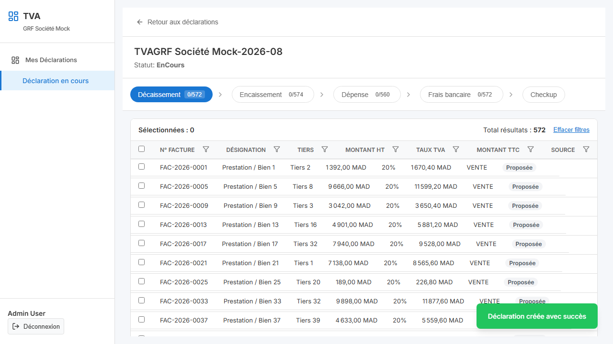
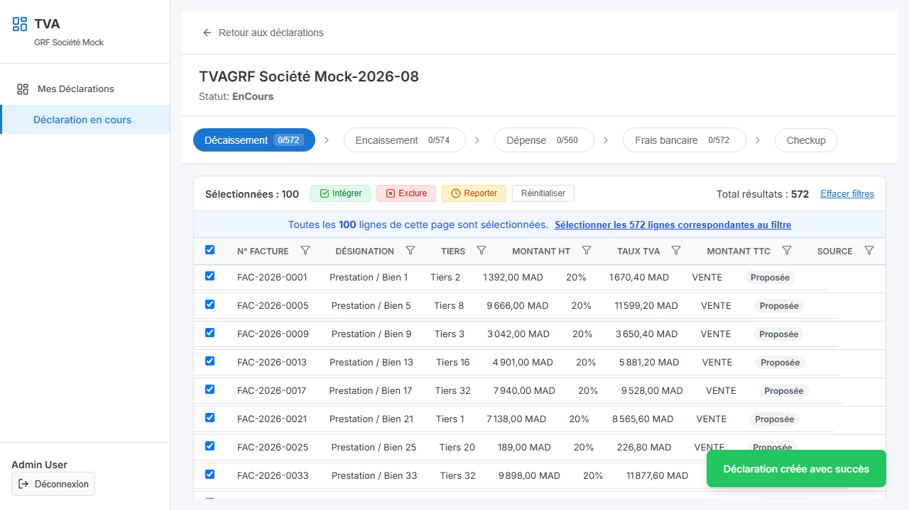
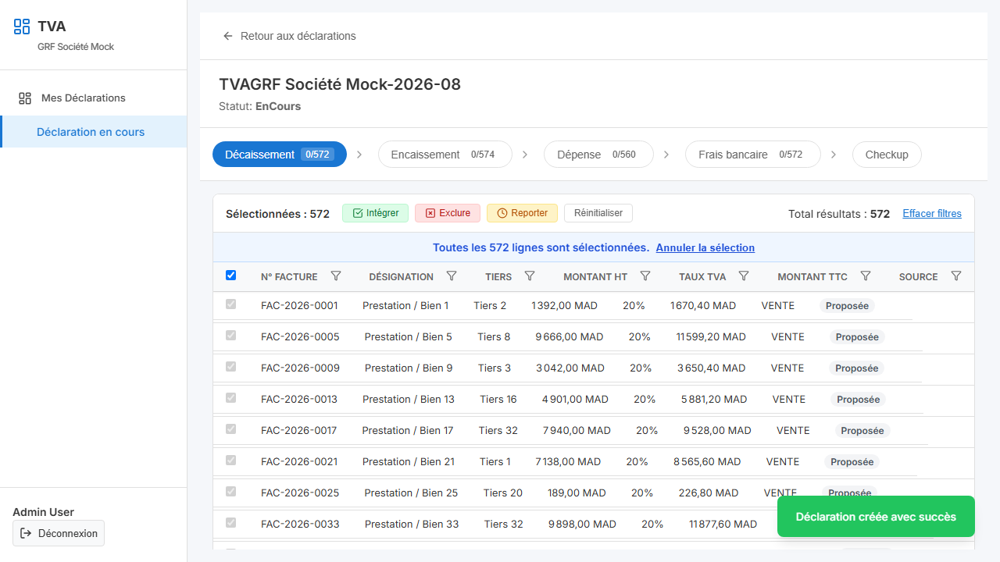
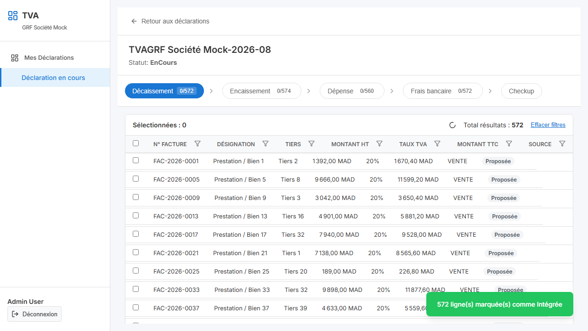

# Vérification TASK-016

## 1. Drill-down anomalie → grille filtrée
Les anomalies dans le panneau de Checkup sont maintenant cliquables. Chaque anomalie est associée à un `domaine` et à un `filtre` spécifique (par exemple, le filtre sur le statut `Écartée` ou `Proposée`, ou l'id de la ligne). Le filtre par `id` fait désormais un match exact (correction de la précision).
- **CheckupPanel.tsx** : Les alertes affichent un effet de survol (hover) avec l'instruction "Cliquez pour voir les lignes concernées".
- **DeclarationStepper.tsx** : La sélection d'une anomalie déclenche la navigation vers l'onglet du domaine concerné tout en préservant le contexte du filtre (`initialFilters`).
- **DomainGrid.tsx** : À l'initialisation, si `initialFilters` est passé, la grille est pré-filtrée. 



## 2. Action de masse sur filtre
L'action de sélection multiple a été repensée pour différencier "Sélection de la page courante" et "Sélection de tous les résultats du filtre" :
- **DomainGrid.tsx** : Lors de la sélection globale (checkbox de l'en-tête), un encart (`Select All Banner`) s'affiche pour proposer à l'utilisateur de basculer en mode `selectAllFilters`.


- S'il valide, la bannière indique "Toutes les X lignes sont sélectionnées".


- Lors de l'application de l'action de masse (ex. Intégrer), l'API est appelée avec le payload : `{ filtres: {...}, domaine: '...' }` plutôt que la liste complète des ids.
- Le backend mock (`mockServer.ts`) la traite correctement et la grille est rafraîchie, remontant un toast de confirmation.


## 3. Récapitulatif par Code Activité
Conformément à la décision, le récapitulatif par Code d'activité est maintenu et l'alimentation est désormais branchée côté SQL (base Sage).
- **SelectionnerAffectationsService.cs** et **SelectionExpliqueeService.cs** : Une jointure `LEFT JOIN F_COMPTET T ON T.CT_Num = M.CT_Code` a été ajoutée pour récupérer `T.CT_APE AS TiersActivite`.

## 4. Tests e2e Playwright
Un nouveau test a été ajouté pour couvrir ce scénario spécifique : `TASK-016: Drill-down anomalie et action de masse sur filtre`.
Le parcours est le suivant :
1. Connexion et création d'une déclaration.
2. Accès direct au Checkup.
3. Clic sur l'anomalie « Lignes proposées dans Décaissement ».
4. Constatation du pré-filtre sur la grille Décaissement.
5. Sélection globale via la bannière.
6. Action de masse "Intégrer".
7. Retour sur Checkup et validation du recalcul (l'anomalie de lignes proposées pour le Décaissement a disparu).

L'exécution des tests e2e avec `npx playwright test` valide les modifications de la TASK-013 et la nouvelle TASK-016 :
```text
Running 2 tests using 2 workers

[1/2] [chromium] › tests\declaration.spec.ts:3:1 › Parcours complet: Création, intégration, checkup, clôture, génération
[2/2] [chromium] › tests\declaration.spec.ts:54:1 › TASK-016: Drill-down anomalie et action de masse sur filtre
  2 passed (9.4s)
```
